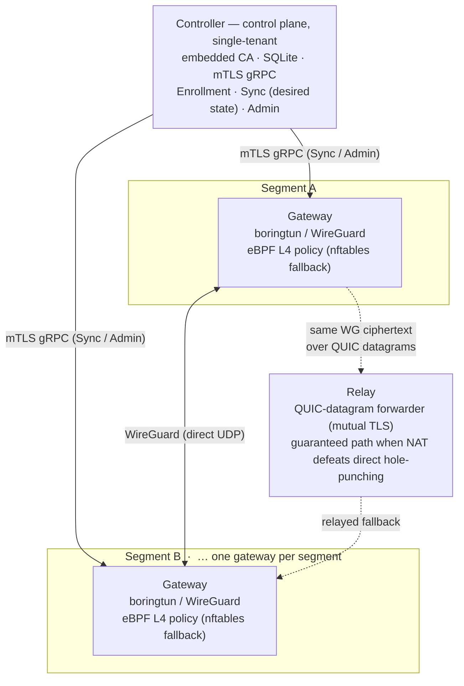

# WireMesh

**A self-hosted, cloud-agnostic, zero-trust L3/L4 network fabric written in Rust.**

WireMesh connects network *segments* — VPCs, VNets, VLANs, bare-metal subnets — using **one gateway per segment**, rather than requiring an agent on every device. There are no agents on your workloads: connectivity is a route change. The data plane is WireGuard; policy is **default-deny** with explicit L4 allow rules, distributed in real time from a central controller and enforced in-kernel via eBPF (with an nftables fallback).

Think *"AWS Transit Gateway + Twingate, but open-source, self-hosted, and cloud-agnostic."*

> **Status: the fabric works; the 1.0 is still being hardened.** Controller, gateway, and relay are built, released, and installable — see [Getting started](#getting-started). Two segments can enroll, mesh over WireGuard, punch through NAT, fall back to a relay, and enforce default-deny policy, with the data plane surviving a controller outage indefinitely. What is not finished is the work that turns that into a 1.0: measured throughput, CI, signed releases, and complete end-to-end operator documentation. The remaining scope is inventoried in [`docs/research/2026-08-11-v1.0-release-scope.md`](docs/research/2026-08-11-v1.0-release-scope.md); read [Known limitations](#known-limitations) before you deploy it anywhere that matters. WireMesh is and will remain **fully open source under Apache-2.0**, built on three commitments:
>
> 1. **No feature gating.** The self-hosted version is the complete product, forever — no enterprise edition, no held-back features.
> 2. **No rug pull.** The license stays Apache-2.0. No relicensing, no source-available switch.
> 3. **Hosted offerings are downstream consumers, not the project.** A managed WireMesh controller — operated by the maintainer or by anyone else — runs the same public binaries everyone gets, and the data plane always stays customer-owned. The project itself ships binaries and documentation.

## Why

- **Segment-level first.** Join whole networks in minutes instead of installing an agent on every host. Connectivity is a route change; workloads are untouched.
- **Zero-trust by default.** 100% of inter-segment traffic is denied unless an explicit L4 allow rule (src/dst CIDR, port range, protocol) exists. Policy is code, changes are audited, and denied flows are counted.
- **Fail-static, not fail-open.** If the controller is unreachable, existing tunnels and the last-applied policy keep working indefinitely — a control-plane outage is never a network outage.
- **Cloud-agnostic & self-hosted.** Run the controller anywhere (VPS, Kubernetes, a managed platform); connect AWS, GCP, Azure, Proxmox, bare metal, homelab — you decide where everything lives.
- **No agents, no kernel modules required.** WireGuard runs in userspace (embedded boringtun); enforcement prefers eBPF but falls back to nftables where BPF privileges are withheld.

### Design goals (targets)

| Goal | Target |
|---|---|
| Time-to-connected (two segments, cold start, from the docs) | **< 30 minutes** |
| Policy propagation (controller → all gateways) | **< 5 s** p99 |
| Zero-trust posture | **default-deny** between segments; no inter-segment flow without an explicit allow |
| Control-plane outage tolerance | **fail-static** — data plane survives indefinitely |
| Platforms | Linux x86-64 + arm64 gateways; AWS / GCP / Azure / Proxmox / bare metal / Kubernetes (node-network mode) |

These are the PRD's acceptance targets. The throughput gate among them (**G-2**, ≥ 1 Gbps) has **not been measured on real hardware** — see [Known limitations](#known-limitations).

## Architecture

Three single-binary components, all in Rust, plus an admin CLI and an optional Kubernetes operator:



- **Controller** — the single-tenant control plane. Embedded fabric CA, embedded SQLite, three gRPC services plus a UDP endpoint for NAT-traversal address discovery. The services do **not** share a security posture: Enrollment is server-TLS only (an unenrolled gateway has no client certificate yet), Sync is mTLS and requires one chaining to the embedded CA, and Admin is a `0700` Unix socket plus a **loopback-only** TCP listener carrying plaintext gRPC behind a bearer token — deliberately excluded from the bind-address setting, since a bearer token on plaintext gRPC would be replayable on a routable interface. Computes the full-mesh topology and streams per-gateway desired state (peer keys, routes, compiled policy, revoked-cert denylist). Driven by the `fabricctl` CLI. Pluggable `SecretStore` / `CertificateIssuer` seams let an external PKI/secrets manager own key material and rotation — the only implementation shipped today is the embedded one.
- **Gateway** — one per segment. Embeds boringtun (userspace WireGuard) for the data plane and enforces default-deny L4 policy with tc-BPF on the tunnel device (nftables fallback). Handles NAT traversal (UDP-native endpoint discovery + brokered hole-punching) and relay failover. No agent runs on the workloads behind it.
- **Relay** — a QUIC-datagram forwarder with mandatory mutual TLS. It keeps no per-flow state and never terminates a tunnel — it carries the same WireGuard ciphertext end to end — but it does hold a per-pair registration table binding each live QUIC connection to its certificate-verified owner, plus a revocation denylist. The guaranteed path for gateway pairs that symmetric NAT/CGNAT defeats.
- **`fabricctl`** — the admin CLI: segments, enrollment and API tokens, relay registration, policy inspection, declarative `apply`, gateway roster and drain, audit queries. It does **not** cover key rotation — see [Known limitations](#known-limitations).
- **Kubernetes operator** — optional. CRDs (`WiremeshController`, `WiremeshSegment`, `WiremeshPolicy`, `WiremeshGateway`, `WiremeshRelay`) reconciled into the same unchanged controller. See [`docs/operator.md`](docs/operator.md).

The full engineering design lives in [`docs/superpowers/specs/2026-07-15-wiremesh-engineering-design.md`](docs/superpowers/specs/2026-07-15-wiremesh-engineering-design.md); the product requirements in [`docs/PRD.md`](docs/PRD.md).

## Getting started

Two supported paths. Both start from a [Release](https://github.com/zozo6015/wireMesh/releases) — every release ships a `SHA256SUMS` file, and **verifying against it is currently your only integrity check**, since artifact signing is not yet provisioned.

- **Packages and systemd** — [`docs/install.md`](docs/install.md). Linux `.deb`/`.rpm`, standalone tarballs, a Windows `.msi` and a macOS `.pkg`. Covers the platform × component matrix, the controller's data directory and what to back up, automatic key rotation and why it is off, and the one-time `enroll` step a gateway or relay needs before its first start.
- **Kubernetes** — [`docs/operator.md`](docs/operator.md). Install the operator via kustomize or Helm, then `kubectl apply` a controller, your segments and policy, and a gateway per segment. Includes the CRD reference, the CA-bundle step gateways require, and the operator's own limitations.

**One gap to know about before you start.** The Kubernetes path is walkable end to end from its document. On the systemd path, `docs/install.md` gets you installed and enrolled but does not yet document the fabric-configuration steps *around* it — creating a segment, minting the enrollment token that `enroll` consumes, distributing the CA, and writing a policy. Those are `fabricctl` subcommands — `fabricctl segment create`, `fabricctl enroll-token` (the single-use enrollment token; **not** `fabricctl token`, which mints API bearer tokens), and `fabricctl apply -f` for policy, since `fabricctl policy` is read-only inspection. Until the quickstart exists, `fabricctl --help` is the reference. Under default-deny, a fabric with no policy applied passes no inter-segment traffic — that is correct behaviour, not a fault.

Progress and the current release are tracked in [`docs/progress.html`](docs/progress.html) (open it in a browser) and on the [Releases](https://github.com/zozo6015/wireMesh/releases) page.

## Project status

Every cycle below is complete and released. The done-bars are integration tests run by hand in the privileged dev container (see [Building & developing](#building--developing)). **CI runs the suite on every pull request** ([`ci.yml`](.github/workflows/ci.yml)): `cargo fmt --check` and `cargo clippy -D warnings` over both workspaces *and* the feature-gated targets, a privileged fast sweep, and three netns jobs covering the eBPF/nftables conformance suite, the gateway data-plane done-bars, and the key-rotation done-bars on a runner of their own. Every job runs inside the `dev/Dockerfile` image with the checkout at `/work` — the same shape as `./dev.sh` — and every privileged job is gated by [`dev/doctor.sh`](dev/doctor.sh), so an unsupported runner fails on a named probe rather than on a confusing test error. A nightly [`cold-build.yml`](.github/workflows/cold-build.yml) rebuilds both Dockerfiles with `--no-cache`, re-verifies the declared MSRV, and checks that the dev image and the release builder still agree on the compiler.

| Cycle | Scope | Status |
|---|---|---|
| **Phase 0** | De-risk spike — the 5 riskiest data-plane bets proven | ✅ **Complete** — verdicts in [`docs/research/phase0-report.md`](docs/research/phase0-report.md) |
| **Cycle 2** | Controller core — embedded CA, data model, Enrollment / Sync / Admin, `fabricctl` | ✅ **Shipped** |
| **Cycle 3** | Policy pipeline — YAML DSL → canonical-JSON IR → eBPF **and** nftables backends, proven behaviorally equivalent by a netns packet suite | ✅ **Shipped** |
| **Cycle 4a** | Gateway binary — embedded boringtun, enforcer wiring, fail-static boot, full-mesh netns milestone | ✅ **Shipped** |
| **Cycle 4b** | NAT traversal — controller-brokered simultaneous hole punching, multi-candidate endpoints, path state machine, NAT-matrix conformance | ✅ **Shipped** |
| **Cycle 4c** | Relay path — the `wiremesh-relay` binary, relay enrollment/advertisement/health, gateway relay transport; a symmetric-NAT pair whose punch fails flows real WireGuard over the relay | ✅ **Shipped** |
| **Key rotation** | Per-gateway WireGuard key rotation, including the fabric-wide in-step case | ✅ **Shipped** as a mechanism — but the automatic schedule is **off by default** and on-demand rotation has no CLI (below) |
| **Kubernetes operator** | CRDs + reconcilers, PVC-persisted identities | ✅ **Shipped** — validated end-to-end on a real k3s cluster |
| **Packaging & releases** | deb/rpm/msi/pkg/tarballs + container images, versioned from the git tag | ✅ **Shipped** |
| **v1.0 hardening** | Throughput measurement, CI, release signing, OSS hygiene, quickstart + runbooks | 🚧 **In progress** — [release-scope inventory](docs/research/2026-08-11-v1.0-release-scope.md) |

## Known limitations

Stated here because you should not have to find them in the backlog.

- **A single-host client peer is designed but not implemented.** The PRD scopes a client peer for workstations that must join the fabric directly, and its requirements (G-4a, X-8) are written as though it exists. **There is no code for it** — no client crate, no client-kind enrollment, no provisioning path. It remains the intended direction; it is not something you can download today. (Release-scope finding B11.)
- **Automatic key rotation is off by default, and arming it is an informed choice.** An unset `WIREMESH_ROTATION_INTERVAL` means *no timer*, not a default one. The scheduled path drives a known-open defect — the *rotation wedge*, [`docs/BACKLOG.md`](docs/BACKLOG.md) item 9: a gateway honours a rotate directive only while its rotation state machine is idle, and a rotation that fails part-way through parks it off-idle, after which that gateway **silently ignores every later rotation until its process restarts** and never scrubs the old key. The timer is what makes that fabric-wide, since it fires for every active gateway on one tick. Full operator-facing detail in [`docs/install.md`](docs/install.md#automatic-key-rotation-wiremesh_rotation_interval).
- **On-demand key rotation has no CLI, so in practice there is no ergonomic rotation path at all.** The Admin `RotateKey` RPC exists and works (`proto/wiremesh/v1/admin.proto`), and it rotates one gateway you choose, when you choose — but **`fabricctl` cannot call it**; the RPC has no caller anywhere outside the gateway crate's key-rotation tests. Using it today means hand-rolling a gRPC call against the Admin service, which binds **loopback-only** by design and takes an admin bearer token (`fabricctl token mint --role admin`), so you must make that call from the controller host itself. Treat key replacement as a manual, scripted operation you build, not a feature you drive — and read the wedge above before automating it. A `fabricctl` wrapper is outstanding 1.0 work.
- **Throughput has never been measured on real hardware.** The PRD's G-2 gate (≥ 1 Gbps single-flow and aggregate on a 4-vCPU cloud VM) is **unretired**. The only numbers that exist are ~7 Mbit/s with a receive-side delivery cap inside a Docker-Desktop dev container on Apple Silicon — believed environmental, never confirmed. The bench and its exact procedure are built and documented; the run has not happened. Do not plan capacity against this project until it has. See [`docs/research/phase0-results.md`](docs/research/phase0-results.md).
- **Gateways are Linux-only.** The controller and relay are Unix servers, so macOS gets those plus `fabricctl` and Windows gets `fabricctl` alone — there is no data-plane artifact for either. The gateway also needs `iproute2`, `nftables`, `conntrack-tools` and `procps` on its host, and mutates `net.ipv4.ip_forward`/rp_filter via `sysctl`. See the platform matrix in [`docs/install.md`](docs/install.md).
- **IPv4 only** in v1, including controller dial targets — an IPv6 literal is rejected at boot.
- **The `Relayed → Direct` make-before-break cutover is a fast-follow, and it is currently inert.** A pair that falls back to the relay **stays there for the life of the process**, whatever its NAT type — the path state machine still emits a direct-probe action and still rate-limits it, but the gateway's handler for that action is a deliberate no-op, kept as the seam the fast-follow will re-wire. A reliable cutover needs a forced WireGuard rehandshake, which is the work that has not landed. The relay path itself is stable.
- **No gateway HA.** One gateway per segment is a design invariant, not a current limitation of the implementation.
- **Releases are not signed.** `SHA256SUMS` gives you corruption detection, not authenticity; the Windows `.msi` is not Authenticode-signed and the macOS `.pkg` is not notarized. Verify checksums.

The full, honest inventory of what stands between this and a 1.0 — including the items above — is [`docs/research/2026-08-11-v1.0-release-scope.md`](docs/research/2026-08-11-v1.0-release-scope.md). Open defects and follow-ups are tracked in [`docs/BACKLOG.md`](docs/BACKLOG.md).

## Repository layout

```
crates/                     the Rust workspace (11 members)
  wiremesh-proto/           gRPC wire contract (Enrollment / Sync / Admin)
  wiremesh-trust/           CertificateIssuer / SecretStore seams + embedded CA
  wiremesh-controller/      the controller binary
  fabricctl/                admin CLI
  wiremesh-policy/          policy DSL parser/validator + canonical-JSON IR compiler
  wiremesh-enforcer/        enforcement backends — tc-BPF (eBPF) and nftables
  wiremesh-enforcer-ebpf/   the eBPF program; a standalone aya workspace, not a member
  wiremesh-gateway/         the gateway binary
  wiremesh-relay/           the relay binary + mkcerts + wiremesh-relay-enroll
  wiremesh-enroll/          client-side enrollment (token redemption → signed leaf)
  wiremesh-operator/        Kubernetes operator — CRDs + reconcilers
  wiremesh-testkit/         shared test harness (in-process controller, netns lab)
proto/                      the .proto sources
deploy/                     packaging — docker/ helm/ operator/ packages/
docs/
  install.md                packages, systemd, standalone binaries
  operator.md               Kubernetes install + CRD reference
  BACKLOG.md                tracked defects and follow-ups
  progress.html             progress tracker (open in a browser)
  PRD.md                    product requirements
  superpowers/specs/        the approved engineering design + per-cycle designs
  superpowers/plans/        implementation plans (one per cycle)
  research/                 findings, measurements, go/no-go reports
  runbooks/                 operational procedures — one migration runbook so far
dev/                        privileged Linux dev container (Dockerfile + doctor)
scripts/                    release tooling
dev.sh                      container wrapper: build / shell / run
```

The Phase-0 `spike/` crates have been **deleted** now that every bet has graduated into `crates/`. Comments across the workspace still cite `spike/*` paths as provenance — that is accurate history, not a broken checkout; the code is in git history and the verdicts are in [`docs/research/phase0-report.md`](docs/research/phase0-report.md).

## Building & developing

The data plane needs Linux (tun / eBPF / netns / nftables), so all code builds and tests inside a **privileged Linux dev container** — the host may be macOS. A wrapper drives it:

```sh
./dev.sh build                        # build the dev image
./dev.sh run "bash dev/doctor.sh"     # verify kernel/BPF/netns capabilities
./dev.sh run "<command>"              # run a command in the container (repo mounted at /work)
./dev.sh shell                        # interactive root shell in the container
```

The workspace run. Network tests are serial, and long runs want a timeout:

```sh
./dev.sh run "cd /work && timeout 500 cargo test --workspace -- --test-threads=1 --nocapture"
```

**Run that inside the container, not on your host.** It is not a pure-userspace run: `wiremesh-enforcer`'s tests are ungated and genuinely load and attach eBPF on a netns WireGuard device, so they fail loudly anywhere unprivileged.

**Two different flags gate the rest, and one of them fails quietly.** `wiremesh-testkit`'s netns lab and its enforcement-conformance suite are behind that crate's `netns` feature, which the crates needing it already enable. The gateway's own data-plane done-bars — the mesh milestone, the NAT and relay matrices, key rotation, routes and enforcement — are behind a *different* flag, `netns-tests`, on `wiremesh-gateway` alone. That is the one to remember: 15 of the gateway crate's 49 test files sit behind it (counted as: files in `crates/wiremesh-gateway/tests/` carrying the `#![cfg(feature = "netns-tests")]` inner attribute at column 0 — `dev/netns-split.sh check` prints the same number. Testkit's three netns files are a *different* feature, `wiremesh-testkit`'s own `netns`, and are not in this count), and without it they compile to zero tests while `cargo test` prints a green summary that proves nothing.

```sh
./dev.sh run "cd /work && cargo test -p wiremesh-gateway --features netns-tests -- --test-threads=1 --nocapture"
```

The per-crate doctest inventory is pinned by [`dev/doctest-counts.txt`](dev/doctest-counts.txt) and checked in CI: `cargo test --doc` exiting 0 proves the doctests that exist compile, not that the same ones exist, and drift in either direction is a bug — one appearing usually means prose that rustdoc started compiling (a closed Markdown list turns an indented paragraph into a code block), one vanishing is a lost test. Regenerate the table deliberately, from a real run. The script takes the two log paths and runs no cargo itself — `generate` with no arguments exits 2 — so produce the logs first:

```sh
./dev.sh run "cd /work && cargo test -j 1 --workspace --doc" > /tmp/doc-root.log
./dev.sh run "cd /work/crates/wiremesh-enforcer-ebpf && cargo test -j 1 --doc" > /tmp/doc-ebpf.log
dev/doctest-counts.sh generate /tmp/doc-root.log /tmp/doc-ebpf.log > dev/doctest-counts.txt
```

The two arguments are the **root-workspace** log and the **ebpf sub-workspace** log, in that order — not one per crate.

Which gated suite runs in which CI job is decided by one script, [`dev/netns-split.sh`](dev/netns-split.sh) — `check` fails if a gated file is named there but has been renamed or un-gated, so a newly added netns test cannot silently run in no job at all. It detects gating by the `#![cfg(feature = "netns-tests")]` inner attribute **at column 0**, never by a substring match: `tests/punch_endpoint_driven.rs` names the attribute only inside a doc comment and is a plain unit test, which is why a naive grep counts 14 instead of 13.

`crates/wiremesh-enforcer-ebpf` ships its own `[workspace]` (the aya template's, which cargo forbids nesting), so it is excluded from the root workspace — build and test it from its own directory.

Requirements: Docker (Desktop or Engine); the image bundles the Rust toolchain, eBPF tooling, iproute2, nftables, WireGuard tools, and iperf3.

## Roadmap

Toward **1.0** — the full inventory, with sizings, is in the [release-scope document](docs/research/2026-08-11-v1.0-release-scope.md):

- **Retire the open gates.** Measure G-2 throughput on real hardware; close the rotation wedge and give `RotateKey` a `fabricctl` wrapper so key rotation is both safe and reachable.
- **Make the release trustworthy.** Signed artifacts and an install script that verifies before it executes; `SECURITY.md`, `CONTRIBUTING.md`, a published threat model, and third-party licence attribution.
- **Finish the documentation.** A quickstart that goes segment → token → enroll → policy → verified flow on bare metal, a `fabricctl` reference, a policy-DSL reference, and real runbooks (restore, CA rotation, upgrade, component replacement).
- **Decide the open scope items.** The client peer (build it or move G-4a/X-8 past 1.0), and the OpenBao/Vault reference provider for the trust seams.

**Post-1.0 (P1):** provider drivers for AWS/GCP/Azure secrets & PKI, relay multiplexing and the `Relayed → Direct` cutover, a read-only web UI, a Terraform provider, and controller HA.

## Contributing

WireMesh is developed with a strict, review-first workflow (see [`CLAUDE.md`](CLAUDE.md)): tests are authored independently of the code they cover, every change is reviewed by a fresh set of eyes, and no change is called done until its tests pass. Issues and pull requests are welcome. A `CONTRIBUTING.md` is a tracked 1.0 item; until it exists, `CLAUDE.md` and the plans under `docs/superpowers/plans/` are the closest thing to one.

## License

[Apache-2.0](LICENSE). WireMesh is an independent open-source project. The license permits anyone — including the maintainer — to offer commercial hosting, support, or services around it; none of that changes what you get here: the complete product, self-hostable, with no gated features and no relicensing, ever.
