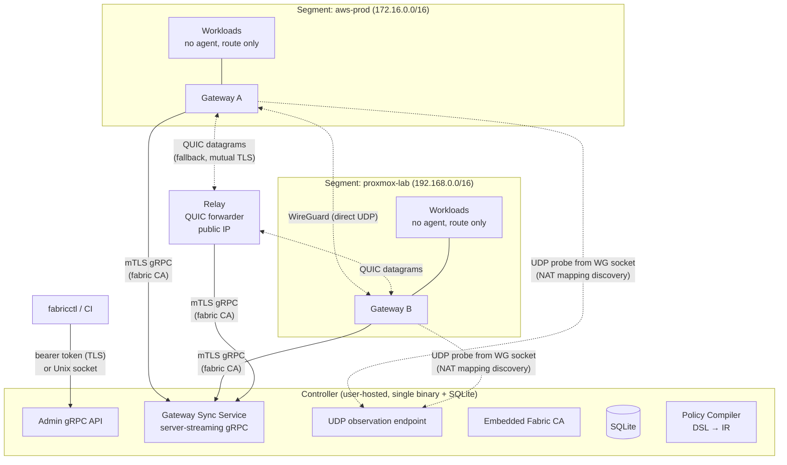
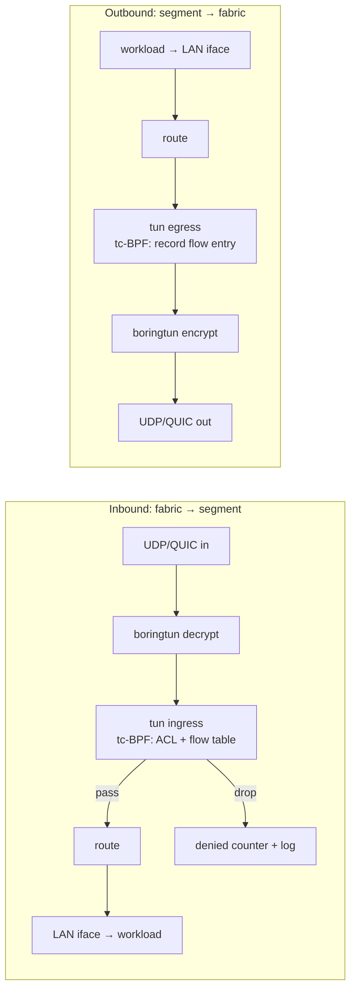
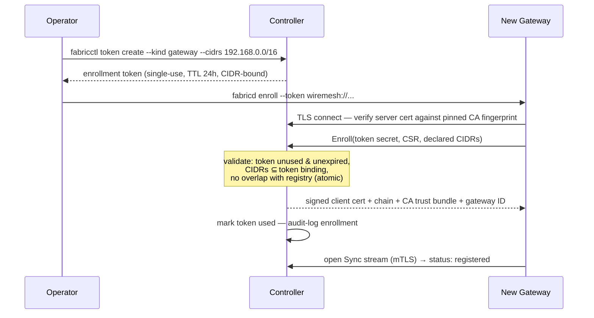
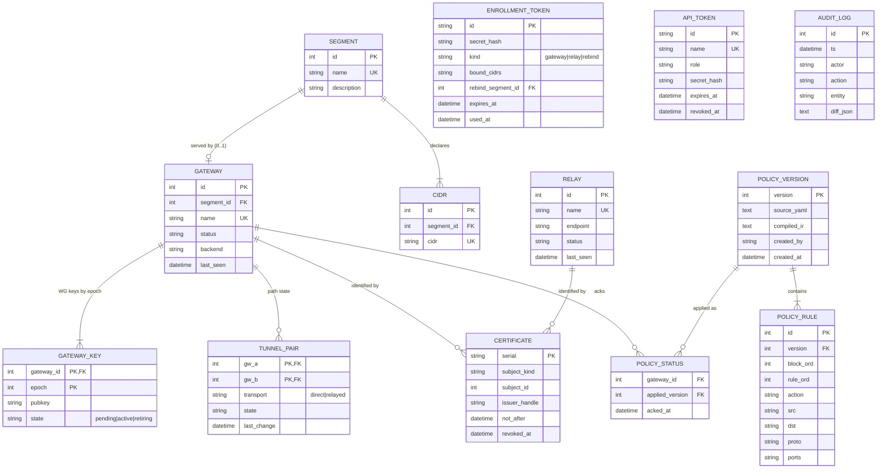
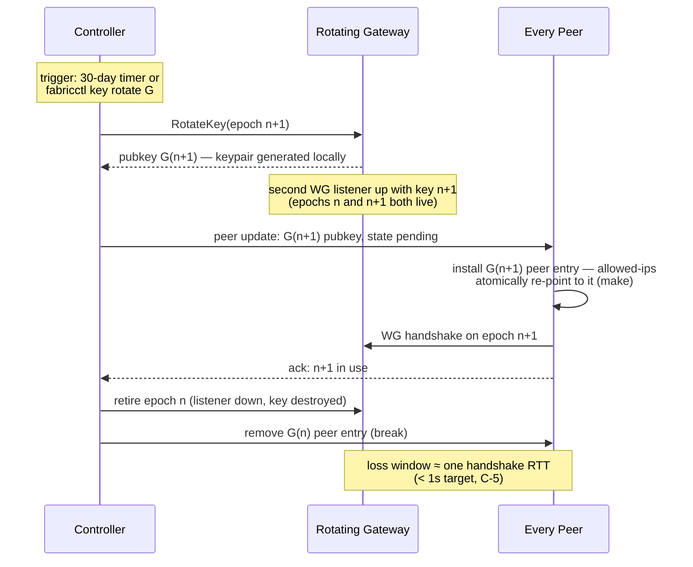
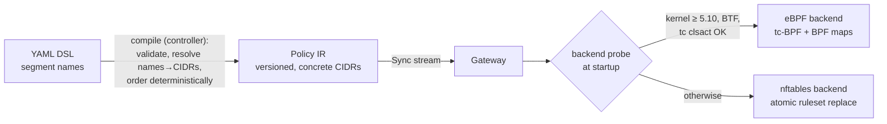
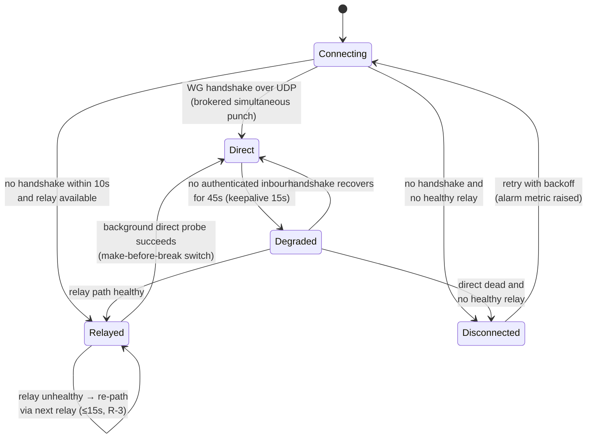

# WireMesh — Engineering Design: Controller, Policy Pipeline & Trust Model

| | |
|---|---|
| **Status** | Draft v0.2 (post design review) |
| **Derived from** | [PRD: Cloud-Agnostic Zero-Trust L3/L4 Network Fabric](../../PRD.md) (Draft v0.1) |
| **Date** | 2026-07-15 |
| **Scope** | Controller data model & API, policy DSL → IR → enforcement pipeline, trust & identity, gateway/relay design, failure semantics |
| **Out of scope** | Phase 0 spike plan (separate doc), per-platform quickstart docs, web UI, Terraform provider internals. Packaging/distribution (PRD X-1b) is design-light and covered only briefly in §6.4 |

---

## 1. Decision Record

This design resolves every open question from PRD §11 plus decisions made during design review. Where a decision **amends** the PRD, it is marked (full amendment list in §11).

| # | Question | Decision |
|---|---|---|
| OQ1 | Policy schema | **Custom YAML DSL** (segment-to-segment), compiled to a backend-agnostic IR |
| OQ2 | Controller store | **Embedded SQLite** (single file; SQL for audit queries; documented backup) |
| OQ3 | Key rotation triggers | **Both**: periodic (configurable, default 30 days) and on-demand via `fabricctl` |
| OQ4 | Route injection | **Manual documented routes + published Terraform modules per cloud.** No cloud credentials on gateways, ever |
| OQ5 | CIDRs per gateway | **Multiple** — a segment declares whatever CIDRs its platform brings |
| OQ6 | Stateful semantics | **Stateful with implicit return traffic** (flow table; security-group-style) |
| OQ7 | Name + license | **WireMesh**, **Apache-2.0**, no CLA |
| OQ8 | Relay abuse prevention | **Mutual TLS on QUIC with existing fabric certs**, offline verification + revoked-serial denylist. No relay tokens |
| OQ9 | Kubernetes gateway mode | **Node-network only in v1** — cluster is an opaque subnet; no CNI interaction |
| D1 | Enforcement backend — **amends PRD** (was nftables P0 / eBPF P2) | **eBPF-first in v1** (tc-BPF on the tunnel interface + BPF LRU flow table); **nftables as fallback** where eBPF is unavailable. Policy IR targets both |
| D2 | Hosting model — **amends PRD** (P2 SaaS controller dropped) | **Fully self-hosted, no project-hosted components, no monetization.** Single-tenant controller: one instance = one fabric = one owner. No tenancy in the data model |
| D3 | Gateway ↔ controller trust bootstrap | **Embedded fabric CA + CA fingerprint pinned inside the enrollment token** (kubeadm-style). WebPKI as optional fallback when the fingerprint is omitted |
| D4 | Human/CI authentication | **Named revocable bearer tokens** (roles: `admin`, `read-only`) + **Unix-socket implicit admin** on the controller host for bootstrap/break-glass. OIDC deferred to P1/P2 |
| D5 | WireGuard key granularity — **amends PRD §10 wording** | **One static keypair per gateway per epoch** (not per-pair). Noise IK's ephemeral DH already prevents a compromised gateway from decrypting other pairs' traffic; per-pair keys add nothing and are incompatible with the boringtun/kernel-WG device model. Rotation granularity is therefore per-gateway (C-5's trigger becomes `fabricctl key rotate <gateway>`) |
| D6 | External cert/secrets managers — **extends PRD** | **Pluggable provider seams** on the controller: `SecretStore` (secret material at rest) and `CertificateIssuer` (mTLS cert signing), with rotation driven by the external manager where one is configured. v1 ships the traits, the embedded defaults, and **one full reference provider: Vault/OpenBao** (KV + PKI engine). AWS (Secrets Manager + Private CA, KMS as an encrypting decorator), GCP (Secret Manager + CA Service), Azure (Key Vault — `SecretStore` only) are P1 drivers behind the proven interfaces. Embedded remains the zero-dependency default — the quickstart never requires an external manager |

Address-family scope: **v1 is IPv4-only** end to end (segment CIDRs, policy, tunnels); IPv6 segments and dual-stack are P2 per PRD §7.3.

CLI name: `fabricctl` is retained from the PRD as the working CLI name; final naming (e.g. `alink`) is a pre-release polish item, not design-relevant.

---

## 2. Architecture Overview

Three components, one embedded CA, one control channel pattern.



Data-plane traffic never touches the controller. The controller distributes *desired state* (peers, routes, relays, policy IR, revocations); gateways enforce locally and keep enforcing if the controller disappears (fail-static, PRD G-6).

### 2.1 Packet path through a gateway



Enforcement placement: **every packet entering a segment from the fabric is checked at the destination gateway** — the zero-trust property cannot depend on the source gateway behaving. Source-side pre-filtering (drop before spending tunnel bandwidth) is a P1 optimization, not a v1 requirement.

---

## 3. Trust & Identity

Everything roots in one **fabric CA**. In the default *embedded* mode the controller generates it at first startup and its private key lives in a **separate file on disk** (`/var/lib/wiremesh/ca.key`, `0600`) — never inside SQLite, so database backups do not contain the CA key. Certificates and serials are recorded in SQLite. The documented backup unit is therefore *the SQLite file plus the key directory*. Both the CA and secret storage are pluggable provider seams (§3.4) — an external PKI (Vault/OpenBao, AWS Private CA, GCP CA Service, …) can own signing, and an external secrets manager can own the material at rest and its rotation.

| Relationship | Mechanism |
|---|---|
| Anything → Controller, first contact | One-time enrollment token with pinned CA fingerprint |
| Gateway/Relay → Controller, ongoing | mTLS client cert (embedded default: 90-day lifetime, auto-renew at 50%; external issuer TTL governs — §3.4) |
| Human/CI → Controller | Named bearer token (`admin` / `read-only`); Unix socket = implicit admin |
| Gateway → Relay | QUIC/TLS 1.3; relay presents fabric-CA-issued cert |
| Relay → Gateway | Mutual TLS; client cert verified offline against fabric CA + revoked-serial denylist |
| Gateway ↔ Gateway (data) | WireGuard (Noise); one static keypair per gateway per epoch, generated on-gateway; private keys never leave the gateway |

### 3.1 Enrollment (gateways and relays — same flow)

The enrollment token is a single self-contained blob:

```
wiremesh://controller.example.com:8443/#tok_9f2kQ...@sha256:ab34cd...
        └────────── address ─────────┘ └─ secret ─┘ └─ CA cert fingerprint ─┘
```



Failure specifics (PRD C-1, C-2): a reused or expired token returns a distinct error naming the reason; a CIDR overlap fails **atomically** with an error naming the conflicting segment — no partial registration ever persists (single SQLite transaction).

- The pinned fingerprint is always the **root** CA certificate of the fabric trust bundle (never an intermediate). Tokens minted before a root rotation embed the old root and must be re-minted after a roll — relevant for tokens pre-staged in a secrets manager (§3.4).
- If the fingerprint segment is omitted from the token, the gateway verifies the controller cert against WebPKI roots instead (for controllers with real certs).
- Token binds to expected CIDRs (threat model: token theft can't enroll an arbitrary segment).

**Rebind (gateway replacement).** Replacing the machine serving an existing segment uses a distinct token kind: `fabricctl token create --rebind <segment>`. A rebind token carries the segment ID instead of CIDRs; enrollment with it (a) exempts that segment's own CIDRs from the overlap check, (b) issues a fresh client cert bound to the same gateway identity, and (c) revokes the previous cert (serial → denylist). Segment registration and policy are untouched. This is also the recovery path for cert lapse (§3.2). A normal token can never claim an existing segment's CIDRs — only an explicit rebind can, and it is audit-logged as a replacement.

### 3.2 Certificate lifecycle

- Client certs: **90-day lifetime, renewal attempted from 50% of lifetime** over the existing mTLS channel (new CSR, same identity). Renewal is invisible to the data plane.
- `fabricctl gateway list` prominently flags certs past 75% of lifetime unrenewed.
- **Lapse recovery:** if a cert expires while the controller is unreachable for months, the data plane keeps running (fail-static) but the gateway cannot rejoin the control plane; recovery is a **rebind token** (§3.1) — credential replacement, not reconfiguration.
- **Revocation:** decommissioning or `fabricctl gateway remove` revokes the cert; revoked serials are pushed to all gateways and relays as part of normal sync (a denylist of a handful of serials — revocation is rare). Short lifetimes bound the exposure window.
- **CA lifecycle (embedded mode):** the fabric CA cert is issued for **10 years**. Rotation path (documented, expected once per deployment lifetime): generate new CA → cross-sign → push both roots via Sync → leaves re-issue under the new CA at their normal 50% renewals → retire the old root after all leaves have rolled. CA-key compromise recovery is a new CA plus fleet re-enrollment via rebind tokens — the documented worst-case runbook.
- **External-issuer mode (§3.4):** the external PKI owns CA lifetimes, leaf TTLs, and rotation cadence; the controller *follows* — the renewal loop keys off each issued cert's actual `not_after` (still the 50% rule, against whatever TTL the issuer granted), and upstream root/intermediate rotation is absorbed via the same dual-root Sync distribution as above.

### 3.3 Human/CI authentication

- **Bootstrap:** on the controller host, `fabricctl` over the Unix socket (`/run/wiremesh/controller.sock`, `0700`) is implicitly `admin`. This is also the break-glass path.
- **Remote:** `fabricctl token create --name peter --role admin` mints a named bearer token (hash stored, plaintext shown once). Config lives kubeconfig-style at `~/.config/fabricctl/config` with named controller contexts. Server verification uses the same pinned-CA logic as gateways.
- Roles are exactly two in v1: `admin` (mutate), `read-only` (topology, status, audit). Token names become the `actor` field in the audit log (C-8).

### 3.4 Pluggable trust material: `SecretStore` & `CertificateIssuer` (D6)

Enterprises run their trust material through existing managers — Vault/OpenBao, AWS Secrets Manager + Private CA, GCP Secret Manager + CA Service, Azure Key Vault — and **those managers, not the applications, typically own rotation**. The controller therefore exposes two provider seams; every backend is a driver behind a trait, never a fork. Traits are `async` and object-safe (`dyn`-usable; streams boxed):

```rust
#[async_trait]
trait SecretStore {
    async fn get(&self, key: &SecretRef) -> Result<Versioned<Secret>>;
    async fn put(&self, key: &SecretRef, value: Secret) -> Result<Version>;
    fn watch(&self, key: &SecretRef) -> BoxStream<'_, Versioned<Secret>>;   // native events where available, else polling (default 60s)
}

#[async_trait]
trait CertificateIssuer {
    async fn trust_bundle(&self) -> Result<TrustBundle>;                    // roots + intermediates; polled (default 60s)
    async fn sign(&self, csr: Csr, profile: CertProfile) -> Result<IssuedCert>; // profile: client|server, TTL *request*
    async fn revoke(&self, handle: &IssuerHandle) -> Result<()>;            // best-effort upstream
}
// IssuedCert = leaf + full chain + opaque IssuerHandle (backend-native identity:
// serial for Vault/AWS PCA, resource name for GCP CAS). The handle is persisted
// with the certificate record and passed back to revoke().
```

`put()` is used only for **controller-minted** material (staged token values, the embedded-mode CA key when an external store holds it); a backend configured with read-only credentials simply makes `put()`-dependent features unavailable, loudly, at startup.

**Scope of the seams.** They cover control-plane trust material only: the CA (signing), the controller's own TLS identity, bearer-token and enrollment-token secrets. Two things deliberately stay out: **WireGuard keys** (generated on-gateway, never leave it — a security property, not a storage choice) and **gateway/relay local key files** (their client-cert keys remain local `0600` files; the CSR flow means no external system ever holds them — platform-secret-manager storage on the gateway side is a possible P2, not v1).

**Rotation semantics — the manager is the authority when configured:**

- All `SecretStore` reads are **versioned**; the controller watches every secret it holds and hot-swaps on version change — no restart, no dropped Sync streams (new connections use new material; existing sessions drain naturally). Polling is the *reference* watch path (Vault OSS KV and the cloud secret managers have no generally available native events); the conformance suite tests rotation detection ≤ the poll interval.
- **Rotated root/intermediate:** absorbed like the embedded cross-sign flow (§3.2) — the controller pushes the updated **trust bundle** via Sync *first*, and only begins issuing/renewing leaves under a new root once connected components have acked the bundle revision (dual-root validity covers components that are offline during the roll). This ordering closes the race where a renewed leaf chains to a root its peers haven't received.
- **Leaf TTLs follow the issuer.** `CertProfile.ttl` is a *request*; the issuer's policy wins, and the controller's renewal loop schedules against the actual `not_after` of what came back (50% rule regardless of granted TTL). Guardrails: a configurable **minimum acceptable granted TTL (default 24h)** — below it the controller refuses the issuer config with a clear error, because short TTLs shrink the tolerable-outage window (§3.2 lapse recovery was sized for ~90-day certs); granted TTL is surfaced in `fabricctl gateway list` and metrics. Additionally, the controller accepts a **briefly-expired client cert for the renewal RPC only** (bounded grace, default 72h, configurable, audit-logged) so a manager or controller outage slightly longer than one TTL causes a renewal storm, not a fleet-wide rebind.
- **Revocation is two-way.** Fabric-initiated revocations are forwarded upstream best-effort via `revoke()`. In the other direction, the controller **polls the issuer's CRL (default 5m)** and imports any fabric-subject serials revoked directly in the manager into the fabric denylist — so an operator revoking in Vault/PCA takes effect on the fabric within one poll. The **pushed denylist remains the authoritative artifact** for gateways and relays — their verification stays offline and controller-outage-tolerant (§7) no matter which issuer is configured.
- **Token secrets by reference, rotation controller-driven.** Config accepts `SecretRef` URIs (e.g. `vault://secret/fabric/ci-token`) anywhere a token literal is accepted, so tokens never land in config files. But tokens are controller-minted secrets whose hashes live in SQLite — an external manager *stores* them, it cannot invent new valid ones. Rotation therefore originates at the controller (`fabricctl token rotate <name>` or schedule): mint → hash to SQLite → `put()` the new plaintext to the manager, whose consumers pick it up via their normal manager tooling.

**Manager-outage contract (normative — the controller-side analog of fail-static):** the controller caches last-known-good material (its own TLS identity, trust bundle, dereferenced token hashes) in its local state, encrypted at rest via an age-style key file when an external store is configured (the cache must not silently recreate the plaintext-on-disk posture the manager was bought to avoid — this is documented). With the manager unreachable or sealed: the controller **starts and keeps serving Sync** from cached material; renewals and `sign()` retry with backoff and raise an alert metric; enrollment and rotation fail loudly with errors naming the manager. A manager outage degrades issuance — it never degrades the running fabric.

**Secret zero.** The controller's own credential *to* the manager (Vault AppRole / Kubernetes auth, cloud instance IAM for P1 drivers) is explicitly outside the seams — it's bootstrap configuration: a `0600` file or platform-native identity, never logged, documented per driver (X-3).

**Backup/DR in external mode:** the fabric backup unit shrinks to **SQLite alone** (no key directory — the manager owns key material and its own DR, which is out of scope). The restore runbook is ordered: manager first, then SQLite, then controller start; the CRL poll reconciles any revocations that happened in the manager while the fabric was down.

**v1 backends:** `embedded` (files + SQLite + built-in CA — the default; the quickstart never requires an external manager) and **Vault/OpenBao** (KV v2 + PKI engine) as the reference external provider proving both seams. P1 drivers: **AWS** (Secrets Manager for `SecretStore`, Private CA for `CertificateIssuer`; KMS is not a store — it ships as an `EncryptedSecretStore` *decorator* wrapping the embedded store, envelope-encrypting SQLite-resident secrets), **GCP** (Secret Manager + CA Service), **Azure** (**`SecretStore` only** — Key Vault is not a CA and has no CSR-signing service; a "Key Vault-held CA key with controller-built certs" hybrid is a possible later driver shape, distinct because rotation authority stays with the fabric). Product notes for implementers: AWS Certificate Manager and Google Certificate Manager are not private-chain issuers and cannot sign arbitrary CSRs — the applicable services are AWS *Private CA* and GCP *CA Service*.

---

## 4. Controller

Single Rust binary (`wiremesh-controller`), embedded SQLite, no external dependencies. Deployable as systemd unit, `docker run`, or Kubernetes Deployment — the project ships artifacts, never infrastructure. **Deployment requirement:** the controller's UDP observation endpoint (§6.1) must be reachable without source-address rewriting — behind a Kubernetes Service/LB this means a UDP LoadBalancer with externalTrafficPolicy preserving source addresses, or direct host exposure; the docs call this out per platform.

### 4.1 Data model



Notes:

- **Segment vs gateway** are distinct entities even though a live segment has exactly one gateway — policy references segment *names*; the gateway is the machine serving the segment and can be replaced via rebind (§3.1) without touching policy. A segment may transiently have no gateway (pre-enrollment, post-drain).
- **No tenancy anywhere** (D2). One controller = one fabric.
- **`GATEWAY_KEY` holds one row per (gateway, epoch)** with a state machine (`pending` → `active` → `retiring` → deleted), so a controller restart mid-rotation resyncs gateways into the exact dual-epoch state (§4.4) — the snapshot always reproduces reality. `TUNNEL_PAIR` (PK: ordered `gw_a < gw_b`) tracks only path/transport bookkeeping, never key material.
- **CIDR overlap invariant** is enforced in one place: inserting into `CIDR` runs an overlap check against all registered CIDRs inside the enrollment transaction (rebind tokens exempt their own segment's rows). Reject names the conflicting segment (C-2).
- `POLICY_VERSION.compiled_ir` caches the compiler output so gateways reconnecting after controller restart receive identical bytes (no recompile drift).
- Backup story (embedded mode): `sqlite3 .backup` (or litestream) **plus the key directory** (§3); restore = replace both + restart; gateways reconnect with existing certs (C-7 — no re-enrollment after controller restart/restore). In external-manager mode the backup unit is SQLite alone (§3.4).

### 4.2 API surface (gRPC)

Three gRPC services on one TCP port, plus the UDP observation endpoint (§6.1), plus the Unix socket exposing `Admin` only:

| Service | Consumer | Auth | Shape |
|---|---|---|---|
| `Enrollment` | new gateways/relays | enrollment token (TLS, no client cert yet) | unary `Enroll(token, csr, cidrs) → cert` |
| `Sync` | enrolled gateways & relays | mTLS client cert | server-streaming `Watch() → stream StateSnapshot/Delta`; unary `Report(status)` upstream |
| `Admin` | `fabricctl`, CI, future UI | bearer token or Unix socket | unary CRUD: segments, gateways, relays, policies, tokens, audit query, drain |

`Sync.Watch` semantics: on connect, the controller sends a **full desired-state snapshot** (peer public keys by epoch + candidate endpoints, routes, relay list, compiled policy IR + version, revoked serials), then deltas. Every message carries a monotonic revision; gateways ack applied policy versions via `Report`, which populates `fabricctl policy status` (C-4) and route-propagation measurement (C-3's 5s p99 target).

Declarative config (C-6): `fabricctl apply -f fabric.yaml` performs a server-side diff against current state; idempotence means an identical apply produces an empty diff, zero mutations, and zero audit entries.

A REST/JSON translation (grpc-gateway) is P1; v1 ships gRPC + `fabricctl` only.

### 4.3 Route computation

Full mesh (PRD §8): for N gateways, the peer set of each gateway is the other N−1. Per gateway, the controller emits: for each peer → (peer public key(s) with epoch states, candidate endpoints, allowed-ips = peer segment's CIDRs, relay fallback list). Adding/removing a segment triggers a delta to all gateways; drain (G-7) marks the gateway `draining`, emits route withdrawal to all peers, waits for acks (or 5s timeout), then removes it and revokes its cert.

### 4.4 WireGuard key lifecycle (C-5)

Each gateway has **one static keypair per epoch**, generated locally; only public keys transit the controller. Rotation is per-gateway (D5) and make-before-break:



Mechanics: WireGuard's cryptokey routing makes the peer-side switch atomic — assigning G's allowed-ips to the epoch-n+1 peer entry moves them off the epoch-n entry in one step. The rotating gateway runs a second in-process WireGuard listener for the transition window (boringtun is embedded, so this is two `Device` instances sharing the tun, not a second process). If any peer fails to ack, the controller leaves epoch n active everywhere and retries — rotation is never destructive on failure. `GATEWAY_KEY.state` mirrors each step, so a controller crash mid-rotation resumes correctly from the snapshot.

### 4.5 Audit log (C-8)

Every mutating Admin operation and every lifecycle event (enrollment, rebind, rotation, drain, revocation) appends `{ts, actor, action, entity, diff_json}`. Actor is the token name, `unix-socket`, or `system` (timer-driven rotation). Queryable via `Admin.AuditQuery` with filters; `fabricctl audit export` streams JSON lines.

---

## 5. Policy Pipeline: DSL → IR → Backends



### 5.1 DSL (OQ1)

```yaml
policy:
  - from: proxmox-lab          # segment name
    to: aws-prod               # segment name
    rules:
      - deny:  { ports: [22], proto: tcp }                          # carve-out, first match wins
      - allow: { dst: 172.16.1.50/32, ports: [5432], proto: tcp }   # Postgres
      - allow: { dst: 172.16.2.0/24, ports: [443, "8000-8080"], proto: tcp }
```

Semantics (normative):

1. **Default deny.** A flow with no matching rule in the matching block — or no block for its (src segment, dst segment) pair — is dropped.
2. **Blocks are directional**: `from: A, to: B` governs flows initiated A→B only. Return traffic is implicit (OQ6); B→A initiation needs its own block.
3. **First match wins** within a block, rules in written order. This makes deny carve-outs natural and evaluation order trivially deterministic (PRD §8 requirement). At most one block per ordered segment pair (compile error otherwise) — so cross-block ordering questions cannot arise.
4. Rule fields: `src` (CIDRs, must be ⊆ the *from*-segment's CIDRs) and `dst` (CIDRs, ⊆ the *to*-segment's CIDRs) — compile error otherwise; omitted = the whole respective segment. `ports`: list of ports and `"lo-hi"` ranges — **requires an explicit `proto` of `tcp` or `udp`; `ports` with `proto: icmp` or with `proto` omitted is a compile error.** `proto`: `tcp` | `udp` | `icmp` (ICMPv4 — v1 is IPv4-only); omitted = all three.
5. **Stateful**: an allowed flow's reply traffic passes via the flow table without a rule. New-flow determination is direction-of-first-packet, not TCP-flag heuristics.

Segment name → CIDR resolution happens **at compile time on the controller**; gateways only ever see concrete CIDRs. Adding a CIDR to a segment triggers recompilation and a new policy version (names are the abstraction, versions are the artifact).

### 5.2 IR

Ordered blocks of ordered rules per policy version — designed to be trivially compilable to either backend and stable for eBPF (PRD §7.3 design constraint):

```
PolicyIR {
  version: u64,
  blocks: [ { src_cidrs: [..], dst_cidrs: [..],          // segment pair, resolved
              rules: [ { action: Allow|Deny, src: [..], dst: [..],
                         proto: Tcp|Udp|Icmp|Any, ports: [(lo,hi)..], rule_id } ] } ]
}
```

`rule_id` is stable across versions when the rule text is unchanged (content hash), so per-rule counters survive policy updates.

### 5.3 eBPF backend (D1 — primary)

- **Attachment:** `tc` clsact **ingress on the WireGuard tun device** = decrypted packets entering the segment (the enforcement point), and clsact **egress on tun** = packets leaving the segment (flow recording only, no enforcement). tun is an L3 device — no Ethernet header; programs key off `skb->protocol`. tc-BPF is chosen deliberately: post-decrypt packet rates are the relevant load, tun XDP support is partial/driver-dependent and not relied upon, and if kernel WireGuard mode lands (P1) the same tc programs attach unchanged (XDP on the physical NIC would only ever see ciphertext and remains a non-goal).
- **Maps:** per policy *generation*: LPM-trie maps for src/dst CIDR matching and an array map of rule metadata (action, proto, port ranges) evaluated first-match. Generation-independent: the **LRU hash flow table** (default 1M entries, configurable) and per-`rule_id` + default-deny counter maps (X-2).
- **Flow table (stateful semantics, OQ6):**
  - Keys: `(src ip, dst ip, proto, src port, dst port)` for TCP/UDP; for ICMP echo, the ICMP identifier takes the port slots. **ICMP error packets (unreachable, fragmentation-needed, TTL exceeded) are matched by parsing the embedded IP+L4 header and looking up the *embedded* flow, forward or reverse** (the Cilium approach) — without this, default-deny would kill PMTUD and produce hung TCP sessions.
  - Entries are created on tun-egress (locally initiated flows) **and on every tun-ingress allow verdict** (inbound-allowed flows) — so established flows in both directions survive policy changes. A policy update therefore affects a live allowed flow only at its next *new* connection (security-group semantics); `fabricctl gateway flush-flows` forces immediate re-evaluation.
  - Entries refresh on traffic in **both** directions. Idle timeouts (configurable): TCP 7200s, UDP 60s, ICMP 30s.
  - **Eviction is a real failure mode:** under LRU pressure an idle-but-live flow's next reply packet is treated as a new (usually denied) flow. Mitigations: occupancy and eviction-rate metrics with alert thresholds in the reference dashboard, and a **per-source-IP new-entry rate cap at egress** (default 256 new flows/s per source, configurable) so a single misbehaving workload cannot churn the table and evict other segments' return-path state. The failure mode and sizing guidance are documented.
- **Atomic updates (G-4):** implemented as **map-in-map** (`BPF_MAP_TYPE_ARRAY_OF_MAPS` holding each generation's LPM/rule maps). The program reads the active generation index exactly once per packet, so lookups can never straddle generations; flipping the index is atomic, and the kernel's RCU semantics guarantee in-flight packets finish on the old generation before it is freed (grace period: 10s after flip, then the old generation's maps are deleted). No enforcement gap, no transient allow-all/deny-all. The flow table is generation-independent and persists across updates.
- **Verdicts:** pass to stack or drop + increment counters. Denied flows are counted always and logged sampled via a rate-limited ring buffer (defaults: 10 events/s per rule, 100/s aggregate, configurable).

### 5.4 nftables backend (fallback)

Selected when the eBPF probe fails (kernel < 5.10, missing BTF, LXC without the needed privileges). The same IR compiles to an nftables ruleset in a dedicated table; updates use `nft`'s native **atomic ruleset replacement** (single transaction — same no-gap guarantee). Statefulness uses kernel conntrack (`ct state established,related accept` scoped to fabric interfaces — `related` gives ICMP-error handling for free, matching §5.3's explicit handling). Per-rule counters come from named nft counters mapped to `rule_id`.

The gateway reports its active backend to the controller (`fabricctl gateway list` shows it); behavior is identical by construction — the IR is the contract, and the same conformance packet-suite (§9) runs against both backends to prove parity, ICMP semantics included. **One ratified exception** (Cycle 3 conformance finding, owner decision 2026-07-18): a purely one-way UDP flow (sender never replied) does *not* survive a rule-removing policy update on the nftables backend the way it does on eBPF — conntrack never promotes an unreplied UDP flow past `ct state new`, so it is re-evaluated against the live ruleset every packet. Broadening the accept line to `ct state new` is rejected (it would let any not-yet-established flow bypass rule evaluation, breaking new-connection enforcement). This is an accepted limitation of the fallback backend; all TCP and all bidirectional flows are unaffected. See the Cycle 3 design (`docs/superpowers/specs/2026-07-17-policy-pipeline-design.md` §1) and `docs/research/cycle3-policy-notes.md`.

---

## 6. Gateway

Single static Rust binary (`wiremesh-gateway`), x86-64 + arm64 (G-1). In-process components:

| Component | Responsibility |
|---|---|
| Sync client | mTLS stream to controller; applies snapshots/deltas; acks versions; persists state bundle |
| Tunnel manager | embedded boringtun; per-epoch static keys; endpoint management; NAT traversal; relay failover |
| Enforcer | backend probe; IR → eBPF or nftables; counters |
| State store | last-applied desired state at `/var/lib/wiremesh/state.json` (0600) + WG private keys — powers fail-static |
| Metrics/logs | Prometheus endpoint; structured JSON logs |

### 6.1 NAT traversal, MTU & relay failover (G-3, R-3)

Per peer pair, direct WireGuard is the goal; relay is the guaranteed path (PRD risk posture: "relay-first mentality").

**Endpoint discovery.** NATs map TCP and UDP independently, so the controller's view of a gateway's gRPC (TCP) source address says nothing about its WireGuard UDP mapping. Discovery is therefore UDP-native:

- The gateway sends periodic authenticated UDP probes **from its WireGuard socket** to the controller's **UDP observation endpoint**, which echoes the observed source address/port back and reports it over Sync.
- The gateway uses **one local UDP port for both WireGuard and QUIC**, so relays' observed QUIC source addresses corroborate the same mapping (valid on endpoint-independent-mapping NATs, the common case).
- Candidates per pair = observed public mapping + local addresses. The controller **brokers hole punching**: it signals both gateways over Sync to begin simultaneous transmission to each other's candidates within the same second. No STUN dependency in v1; symmetric/CGNAT cases that defeat punching land on the relay, by design.

**MTU.** The relayed path wraps WireGuard in QUIC datagrams (RFC 9221), which cannot fragment; the direct path allows larger packets. To make transport switches loss-transparent, the fabric uses one conservative inner MTU everywhere: **tun MTU 1280** (fits the relayed worst case with headroom: outer IP+UDP+QUIC short header+DATAGRAM frame+AEAD ≈ 60–75 bytes, gateway-ID header 8, WG transport overhead 32). QUIC connections run DPLPMTUD; gateways apply **TCP MSS clamping** on tun for workloads that ignore route MTU. If DPLPMTUD on a specific relay path ever reports a limit below the required payload, the gateway lowers that peer route's MTU and raises a metric/log. Per-peer MTU raising (1420 on verified direct paths) is a P1 optimization.



- WireGuard persistent-keepalive is 15s on every peer; a pair is `Degraded` after 45s without authenticated inbound traffic. Convergence budget: **≤30s to relay when direct is blocked** (G-3), typically ~10s.
- The WireGuard session is identical over both transports — the relay carries the same ciphertext in QUIC datagrams, so transport switches don't rekey; with the fabric-wide MTU (above), a switch loses at most in-flight packets.
- Path preference: direct always preferred; while relayed, direct probes continue at low rate (with backoff) and the pair reverts when a probe completes a handshake.

### 6.2 Fail-static (G-6)

The persisted state bundle contains: peer set + public keys/epochs + endpoints, routes, relay list, compiled policy IR + version, CA trust bundle (≥1 roots + intermediates — plural during rotations, §3.2/§3.4), own client cert (private keys are separate 0600 files). On startup without controller reachability, the gateway restores all of it and enforces the last-applied policy indefinitely. On reconnection, it resyncs from the snapshot (revision comparison makes this cheap). Explicitly **fail-static, not fail-closed**: a controller outage must not become a network outage (PRD §10).

### 6.3 Platform notes (X-1)

Same binary everywhere. Per-platform docs cover: route injection (manual + Terraform module — OQ4), src/dst-check disabling (AWS/GCP/Azure), and required privileges: `CAP_NET_ADMIN` + `/dev/net/tun` (+ `CAP_BPF`/`CAP_PERFMON` or fallback to nftables backend in restricted LXC). Kubernetes mode is **node-network only** (OQ9): the gateway runs as a single-replica hostNetwork Deployment advertising the node subnet; pods/services are reached via NodePort/LoadBalancer like any external client. No CNI interaction, no pod/service CIDR advertisement in v1.

### 6.4 Distribution (X-1b)

Mechanical but P0: static musl builds (x86-64, arm64) as release artifacts, OCI images (gateway, controller, relay), and a `curl | sh` installer that drops the binary + systemd unit and runs `enroll` with a provided token. All three paths converge on the same enrollment flow (§3.1). Helm chart and deb/rpm are P1. Details live in the implementation plan, not this design.

---

## 7. Relay

Single static Rust binary (`wiremesh-relay`). **Stateless means no session or flow state** (R-1, qualified): restart loses only in-flight sessions, which gateways re-establish automatically. The relay *does* persist its identity material — client cert + key, fabric CA trust bundle, and the last-pushed revocation denylist (`/var/lib/wiremesh/`, 0600) — otherwise a relay restart during a controller outage would leave it unable to authenticate anyone, violating the spirit of fail-static.

- **Enrollment:** identical token flow (§3.1) with `--kind relay`; registers its public endpoint; controller advertises it to all gateways (R-2 — usable by all pairs without gateway restarts).
- **Session model:** gateways hold one authenticated QUIC connection per relay they may use. WireGuard packets ride **QUIC unreliable datagrams (RFC 9221)** — no retransmission or head-of-line blocking under the tunnel; DPLPMTUD per §6.1. Each datagram carries a destination gateway ID header; the relay bridges datagrams between the two connections of a pair. The only runtime state is the in-memory map {gateway ID → connection}.
- **Authorization (OQ8):** mutual TLS — the client cert must chain to the fabric CA and its serial must not be on the persisted denylist. Verification is fully offline: relaying keeps working during controller outages, and internet scanners are rejected at the TLS handshake before any forwarding logic.
- **What a compromised relay yields** (threat model §10): WireGuard ciphertext, gateway pair identities, timing and volume. No keys, no policy, no topology beyond its own users.
- **Health (R-3):** gateways probe relays (QUIC ping) and report health via Sync; controller evicts an unhealthy relay from advertisements within 15s; pairs re-path to the next advertised relay.

---

## 8. Observability (X-2)

- **Metrics** (Prometheus, all components): per-peer tunnel state/handshake age/RTT/bytes, transport (direct|relayed|disconnected), policy version applied, per-rule and default-deny packet counters, flow table occupancy **and eviction rate** (§5.3 alert thresholds), relay datagram throughput and active pairs, controller: connected gateways, policy propagation latency histogram (measured from version publish to ack — directly tracks the 5s p99 target), cert expiry gauges.
- **Logs:** structured JSON everywhere; denied flows logged sampled with the §5.3 rate limits (protecting the gateway is a correctness requirement, not a nicety).
- A reference Grafana dashboard ships in the repo.

---

## 9. Testing Strategy

| Layer | Approach |
|---|---|
| Policy compiler | Golden tests: DSL → IR → both backends; property tests for overlap/ordering invariants; the same conformance packet-suite (including ICMP-error and flow-table semantics) runs against eBPF and nftables backends to prove behavioral parity |
| NAT matrix | Network-namespace harness emulating full-cone / symmetric / CGNAT NATs (nft-based emulation); asserts direct-vs-relay outcomes per cell and the ≤30s convergence bound. Runs in CI publicly (X-5) |
| Integration | 3-segment mesh in CI (netns or VMs): enrollment, rebind, route propagation p99, policy propagation p99, rotation under iperf (<1s loss), drain, controller-kill fail-static (1h), controller restore, MTU/transport-switch under load |
| Platform smoke (X-1) | CI quickstart smoke on AWS, Proxmox, Kubernetes (node-network mode), and generic Linux — enrollment through first allowed flow |
| Provider conformance (D6) | One suite run against every `SecretStore`/`CertificateIssuer` backend (embedded + containerized OpenBao in CI): issuance, renewal-follows-TTL (incl. min-TTL refusal), externally-triggered rotation detected ≤ poll interval → hot-swap without dropped Sync streams, upstream CRL revocation → denylist within one CRL poll, `put()` write-back and read-only-backend degradation, and **manager-outage mode**: manager down → controller keeps serving Sync from cache, renewals retry with alert, no crash |
| Soak | Long-running 3-segment reference fabric; 30-day zero-interruption target (PRD lagging metric) |
| Throughput | Phase 0 benchmark: boringtun ≥1 Gbps on 4 vCPU (G-2); tc-BPF enforcement overhead measured and published |

---

## 10. Security Notes & Threat-Model Deltas

The PRD §10 threat model stands; this design adds/changes:

- **Compromised gateway (D5 correction to PRD §10 wording):** the PRD attributed "no lateral decryption" to per-pair keys; the property actually comes from Noise IK's ephemeral DH — possessing gateway A's static keys never enables passive decryption of B↔C traffic. Per-gateway static keys preserve the property exactly; impersonation blast radius (A's identity only) is likewise unchanged.
- **Compromised controller** additionally cannot forge gateway data-plane identity (static keys are gateway-generated), but can rewrite topology/policy — unchanged accepted risk, mitigated by audit log and gateway-side logging of applied versions.
- **Relay auth** is strictly stronger than the PRD assumed (mutual TLS vs. open questions about tokens).
- **eBPF-first** narrows the enforcement TCB to the BPF programs + maps; programs are loaded once at startup and only *maps* change with policy — the code path that handles untrusted input is small, fixed, and auditable. The verifier bounds runtime behavior; the nftables fallback keeps enforcement available where BPF privileges are withheld.
- **Unix-socket admin** is gated by filesystem permissions (`0700`, owner = service user); documented as equivalent to root on the controller host — which it is, by design (break-glass).
- **CA key** lives outside the database (§3), so DB backups are not key material; the CA rotation and compromise runbooks (§3.2) are part of the published threat model.
- Secrets hygiene (X-3): WG private keys and CA key material never serialize into logs, state snapshots sent to peers, or metrics; on-disk material is `0600`.

---

## 11. PRD Amendments Summary

For traceability, this design amends the PRD as follows (to be folded into PRD v0.2):

1. **§7.1 G-4 / §7.3**: eBPF/XDP moves from P2 to **P0 primary enforcement path** (tc-BPF on tun); nftables becomes the fallback backend. Phase 0 spike gains a de-risk item: *stateful tc-BPF ACL with LRU flow table + ICMP-error handling on a tun device*.
2. **§7.3**: SaaS controller offering **removed**; multi-tenancy design constraint **removed** (single-tenant controller).
3. **§10 / §7.1 C-5**: per-pair WireGuard keys replaced by **per-gateway per-epoch keys** (D5); the threat-model property is provided by Noise ephemeral DH. C-5's rotation trigger becomes per-gateway.
4. **§7.1 R-1**: "stateless" qualified to *no session/flow state*; relays persist identity material and the revocation denylist to honor fail-static.
5. **§11**: all nine open questions resolved per §1 above.
6. **§2/§7.2**: project positioning sharpened — fully self-hosted, Apache-2.0, no project-hosted components, no monetization; any managed-platform integration is a downstream consumer provisioning per-tenant controllers, not part of this project.
7. **§7.1/§7.2 (new, D6)**: pluggable `SecretStore`/`CertificateIssuer` provider seams with manager-driven rotation and a normative manager-outage contract — traits + embedded defaults + Vault/OpenBao reference provider are **P0**; **P1** drivers: AWS (Secrets Manager + Private CA; KMS as an encrypting decorator), GCP (Secret Manager + CA Service), Azure (Key Vault, `SecretStore` only — it is not a CA).
8. **Non-Goals item 1 / new G-4a (added 2026-08-05, owner decision)**: a **single-host client peer** is now in scope — a host that joins the fabric for itself only, does not front a network and does not forward. It carries the "a workstation joins the fabric" requirement, which was previously assigned by implication to a Kubernetes gateway deployment that cannot carry it. **User identity, device posture and per-user policy remain out of scope** — this is not a ZTNA product, and policy stays segment-to-segment because the pipeline has no concept of peer identity. Ratified with it: the **G-4a carve-out** (enforcement is ingress-on-tun only, so `segment → client` is unenforced in phase 1, with egress-side enforcement the bar for production-grade), clients addressed from `100.64.0.0/10` with a mandatory client-side conflict preflight that fails closed, and a documented ceiling of roughly a dozen `client × segment` reachability pairs against `MAX_RULES`. Rationale and the failed premise it corrects: `docs/research/macos-exclusion-premise-and-the-client-gap.md`; scope and phasing: `docs/research/client-component-scoping.md`.
   **Note the interaction with the Linux-only gateway decision (Non-Goals item 5), which is UNCHANGED and still stands** on the cost of a third `pf` enforcer backend. The client is a different component; it needs no enforcer of its own precisely because of G-4a.

## 12. Next Artifacts

1. **Phase 0 spike plan** — must de-risk: boringtun throughput (G-2 target) **and an explicit boringtun maintenance-health assessment vs. alternatives**, stateful tc-BPF ACL with flow table + ICMP-error parsing on a tun device (D1), QUIC datagram relay prototype with DPLPMTUD, UDP-native endpoint observation + brokered hole punch, and the NAT-matrix harness skeleton.
2. Proto definitions for `Enrollment`, `Sync`, `Admin`; trait definitions for `SecretStore`/`CertificateIssuer` (§3.4).
3. PRD v0.2 incorporating §11 amendments.

**Implementation planning note:** this design is one coherent document but deliberately *not* one implementation plan. Expect at least four plan cycles: (1) Phase 0 spike, (2) controller core (CA/enrollment/data model/Sync), (3) policy pipeline (DSL → IR → both backends + conformance suite), (4) gateway transport + relay (NAT matrix).
